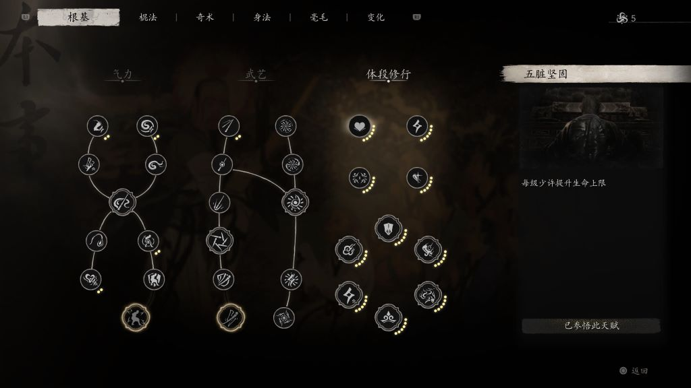
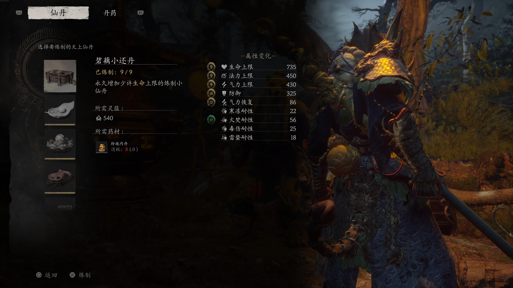

# 《黑神话：悟空》PS5 自动化提升面板属性


## 简介

对于动作游戏入门玩家来说，《黑神话：悟空》的游戏难度并不低，通过适当地提升面板属性,
可以大大提升操作的容错性。
游戏中提升面板属性的方法主要有两种：

1. 通过升级获得灵光点，通过灵光点进行属性增强



2. 第二章解锁戌狗后，通过玲珑内丹制作天上仙丹，从而提升属性



无论哪一种都需要花时间刷属性。和 Steam 端不同，PS5 端由于机器的限制，并不能使用修改器进行属性的快速修改。

该方案借助 **PS5 串流+键盘录制脚本+适合初期的装备+适合刷的地点**，从而可以挂机一键自动化提升面板属性。

注：本项目仅限分享学习之用，禁止以任何方式进行商业传播

## 适用人群

该方案主要适合于如下人群：

1. 菜（如作者本人）。即便靠攻略也很难上手，需要通过增加面板属性提升容错率的玩家。
2. 强迫症患者。对于玲珑内丹，灵光点这些，有强迫症，不点满及其难受的玩家。
3. 多周目需要快速提升面板属性。

## Demo 演示

小西天罪业塔林刷玲珑内丹：

Placeholder: zuiyetalin demo

## 需要软件

- chiaki-ng: 用于将 PS5 通过局域网串流到 PC 端，同时支持通过 PC 侧键盘操控 PS5
- python：运行键盘录制脚本

## 操作流程

以下操作流程仅适用于 Windows 10，其他操作系统理论可行，未测试

1. 安装 chiaki-ng 以及 配置 PS5 串流: https://github.com/streetpea/chiaki-ng

2. 确定串流网络稳定，注意由于按键脚本对于网络的要求比较高，请尽可能将 PS5 和 PC 均通过网线连接至同一路由器下

3. 打开 chiaki-ng 并导入 chiaki 配置文件 chiaki-config.ini，保证 chiaki 按键映射以及分辨率等相关配置和代码一致

4. 远程进入黑悟空

5. 传送至第三章小西天罪业塔林

6. 确认装备，酒，精魂，法术，左下角背包快捷键配置和下图一致。其中装备，精魂，法术，酒等可自由搭配，保证三豆蓄力可以一击必杀上方小怪即可

7. （注：这一步非常重要）用 PS5 手柄手动操作，按照禁字决-喝酒-蓄力重棍的流程跑至上方小怪处松手，一棍击败小怪后，打开背包立即传送回罪业塔林传送点。

   GIF

8. 传送后，此时画面视角会直接朝向小怪，此时我们所有前置步骤完成

9. 在 windows 命令行中运行 python 脚本，注意打开命令行请务必以管理员模式打开

```bash
python automation_script.py --load wukong_zuiyetalin.txt
```

7. 脚本在运行过程中会询问重复几次，输入想要刷的次数后回车即可开始工作

8. 运行过程中必须始终保持 chiaki-ng 串口处于焦点中，运行过程中鼠标不要点击其他窗口

## 方案思路

## TODO

- [ ] 当前方案仅支持罪业塔林，攻击上方小怪后立即传送，操作简单，不容易出错。同时该小怪掉玲珑内丹并且送的经验值不低，可以同时刷灵光点和玲珑内丹。补充其他章节适合利用脚本的刷玲珑内丹和刷灵光点的位置，补充相应的键盘预录制文件。
- [ ] 传送后，自动调整方向，取消最开始需要手动操作一次的要求
- [ ] 提升性能，缩短单次时间
- [ ] 取消需要保持 chiaki-ng 始终处于焦点的要求，允许后台运行，不影响 PC 的正常使用
